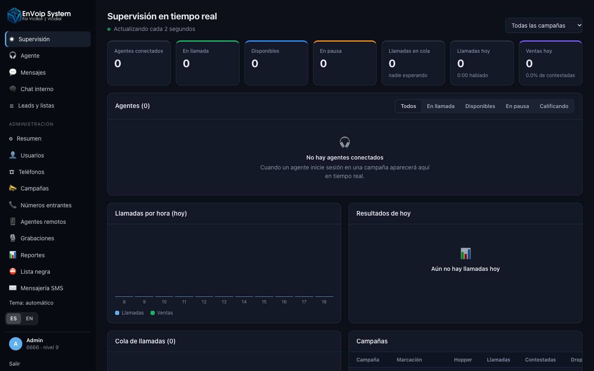
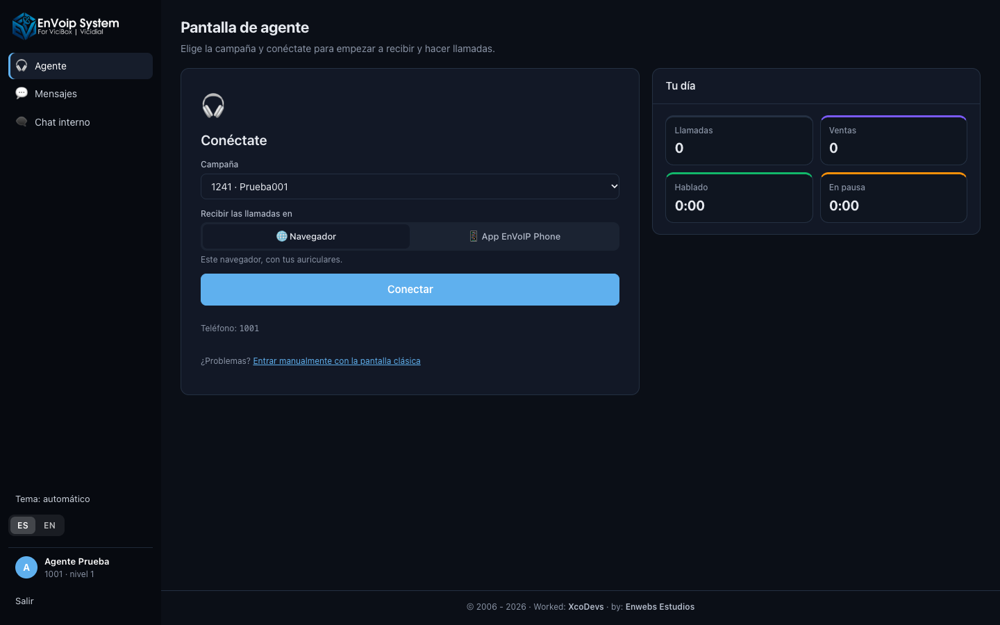
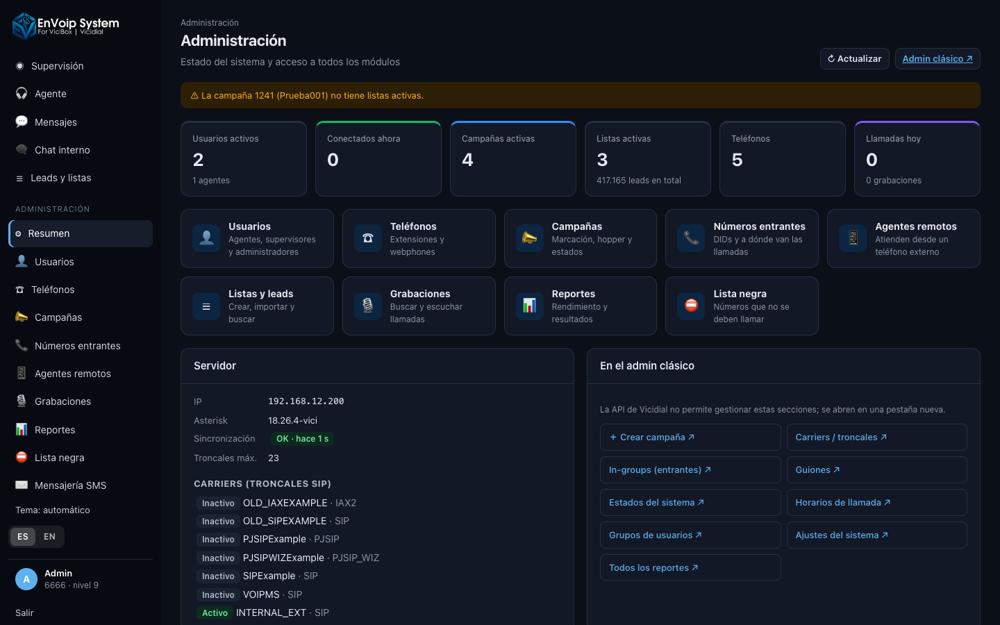

<p align="center">
  <picture>
    <source media="(prefers-color-scheme: dark)" srcset="web/public/logo-dark.png">
    
  </picture>
</p>

<h1 align="center">EnVoip System 1.0</h1>

<p align="center">
  Interfaz moderna para <b>Vicidial / ViciBox</b>: pantalla de agente, supervisión en tiempo real y administración completa,<br>
  en español e inglés, sin modificar Vicidial.
</p>

<p align="center">
  <a href="docs/INSTALACION.md"><b>📘 Guía de instalación</b></a> ·
  <a href="https://github.com/retsill/envoip-phone/releases/latest"><b>📱 App EnVoIP Phone (Windows y Mac)</b></a> ·
  <a href="docs/PRODUCCION.md">Paso a producción</a> ·
  <a href="CHANGELOG.md">Novedades</a>
</p>

---



## Qué es

EnVoip System es una aplicación web que se instala **junto a Vicidial** en un servidor ViciBox y le da
una interfaz actual (React) para agentes, supervisores y administradores.

- **No toca Vicidial.** Trabaja con sus APIs oficiales (Agent API y Non-Agent API) y lee la base de datos
  con un usuario de solo lectura. Las actualizaciones de Vicidial no rompen EnVoip System, y se puede
  desinstalar en cualquier momento.
- **Inicio de sesión único.** El agente entra una sola vez; la sesión clásica de Vicidial (que mantiene
  el audio) funciona oculta en segundo plano.
- **Bilingüe.** Español e inglés, con selector ES / EN (se recuerda en cada navegador).
- **Tema claro y oscuro**, y diseño adaptado a pantallas pequeñas.

> **Requisito:** un servidor **ViciBox 12** con **Vicidial 2.14** ya instalado y funcionando
> (probado con Vicidial `2.14b0.5`, Asterisk `18.26.4-vici`, openSUSE Leap 15.6). Consulta los
> [requisitos completos](docs/INSTALACION.md#1-requisitos).

## Instalación rápida

Como root, en un ViciBox 12 con Vicidial funcionando:

```bash
git clone https://github.com/retsill/envoip-system.git /opt/vicimodern
cd /opt/vicimodern
PUBLIC_HOST=pbx.tuempresa.com bash deploy/provision_vicibox.sh
```

Después abre `https://pbx.tuempresa.com/modern/` y entra con tu usuario de Vicidial.
El script instala Node.js, configura WebRTC, la cola de entrada, los usuarios de la app y el servicio.

👉 **Guía paso a paso, primeros pasos y solución de problemas: [docs/INSTALACION.md](docs/INSTALACION.md)**

## Funciones

### Agentes


- Conexión en un clic: campaña y dónde recibir las llamadas (**navegador** o **app EnVoIP Phone**).
- Cambiar de campaña sin salir, pausas con motivo, colgar, marcación manual y «siguiente lead».
- Ficha del cliente editable, historial de llamadas del cliente y rellamadas programadas.
- Llamadas recientes del agente para volver a llamar con un clic.
- Mensajes SMS/MMS con el cliente desde su propia ficha y chat interno con compañeros y supervisores.

### Supervisores
- Agentes en tiempo real con temporizadores, estado y cliente en llamada.
- **Escuchar, susurrar e intervenir** llamadas; pausar, reanudar o desconectar agentes.
- Cola de llamadas en espera, campañas, llamadas por hora y resultados del día.
- Leads y listas: crear, importar CSV, **búsqueda avanzada** (como «Lead Search Options»),
  ver todos los números de una lista o campaña y **descargar en CSV**.

### Administración


| Módulo | Qué permite |
|---|---|
| Resumen | Salud del sistema: sincronización con Asterisk, carriers, campañas sin listas, webphones sin WebRTC. |
| Usuarios | Crear, editar, activar/desactivar y **duplicar** usuarios con todos sus permisos. |
| Teléfonos | Webphones WebRTC listos para usar y extensiones para la app, con sus datos de conexión. |
| Campañas | Método y nivel de marcación, hopper, timbrado, orden de leads, estados a marcar. |
| Números entrantes | DIDs y su destino: cola, IVR, teléfono, buzón o extensión. |
| Agentes remotos | Activar, campaña y líneas. |
| Grabaciones | Buscar y escuchar en la propia página. |
| Reportes | Rendimiento por agente y resultados por rango de fechas, con exportación CSV. |
| Lista negra | Consultar, añadir y quitar números (DNC). |
| Mensajería SMS | Centro de SMS/MMS con VoIP.ms: bandeja compartida, unión con los leads, baja por STOP. |

Cada acción comprueba el **permiso concreto** del usuario en Vicidial (Modify Users, Modify Campaigns,
Download Lists…), no solo su nivel. Lo que la API de Vicidial no permite (crear campañas, in-groups,
carriers, guiones, horarios) se abre en el admin clásico desde la propia aplicación.

## App EnVoIP Phone

Softphone para **Windows** y **macOS** que se conecta a las extensiones de Vicidial: llamadas, contactos,
historial, SMS y conexión con la pantalla de agente.

| Sistema | Descarga |
|---|---|
| Windows — instalador | [EnVoIP-Phone-Setup.exe](https://github.com/retsill/envoip-phone/releases/latest) |
| Windows — portable | [EnVoIP-Phone-Windows.zip](https://github.com/retsill/envoip-phone/releases/latest) |
| macOS (Intel y Apple Silicon) | [EnVoIP-Phone.dmg](https://github.com/retsill/envoip-phone/releases/latest) |

Código y todas las versiones: [github.com/retsill/envoip-phone](https://github.com/retsill/envoip-phone).
Cómo conectarla a EnVoip System: [guía de instalación, apartado 9](docs/INSTALACION.md#9-app-envoip-phone-windows-y-mac).

## Cómo funciona

```
Navegador ──HTTPS──► Apache (/modern) ──► Node.js / Express (127.0.0.1:3100)
                                             ├─► /agc/api.php                 Agent API (pausar, marcar, colgar, calificar)
                                             ├─► /vicidial/non_agent_api.php  Non-Agent API (usuarios, leads, listas, campañas…)
                                             ├─► MySQL «asterisk», solo lectura (tiempo real, fichas, estadísticas)
                                             └─► MySQL «envoip» (datos propios: SMS y ajustes)
```

- Las credenciales de la API y de MySQL solo están en `/opt/vicimodern/.env` (generado por el script);
  el navegador nunca las ve.
- Todas las **escrituras en Vicidial** pasan por sus APIs.
- El agente siempre actúa como el usuario de su sesión.

## Estructura del proyecto

```
├── server/src        API Node.js (Express): rutas, cliente de las APIs de Vicidial, i18n
├── web/src           Interfaz React (Vite): páginas, componentes, traducciones
├── deploy/           provision_vicibox.sh (instalación), deploy.sh, servicio systemd, proxy de Apache
└── docs/             INSTALACION.md, PRODUCCION.md, capturas
```

## Desarrollo

```bash
cd server && npm install && npm run dev     # API en 127.0.0.1:3100 (necesita el .env del servidor)
cd web && npm install && npm run dev        # Vite con recarga en caliente
bash deploy/deploy.sh                       # compilar e instalar en el servidor
```

**Idiomas:** el texto en español del código es la clave (`t('Conectar')`); las traducciones están en
`web/src/locales/en.json` y `server/src/locales/en.json`. Para añadir otro idioma, crea `xx.json` en ambas
carpetas y regístralo en `web/src/i18n.js` y `server/src/i18n.js`.

## Limitaciones de la versión 1.0

- Requiere las contraseñas de Vicidial **sin cifrar** (opción por defecto de Vicidial).
- La sesión del agente sigue dependiendo de `vicidial.php` (oculto); la pantalla clásica mantiene su propio idioma.
- Crear campañas, in-groups y carriers se hace en el admin clásico.

---

<p align="center">
© 2006 - 2026 · Worked: <a href="https://xcodevs.com">XcoDevs</a> · by: <a href="https://enwebs.net">Enwebs Estudios</a>
</p>

<p align="center"><sub>Vicidial es un proyecto independiente de <a href="https://www.vicidial.org/">The Vicidial Group</a>. EnVoip System no está afiliado a él.</sub></p>
